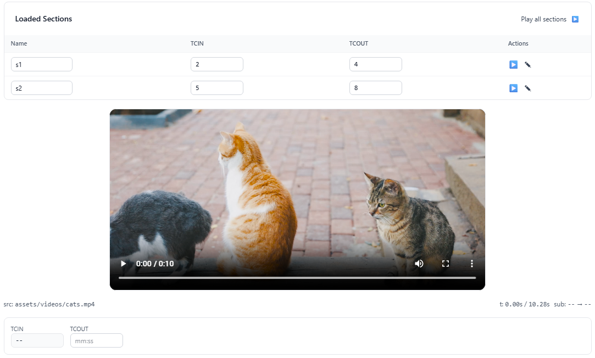

# Clapline




## Current features

- Video source picker with preloaded MP4 samples from `src/assets/videos`.
- HTML5 video player synced to a shared state service for duration and current time.
- Canvas-based timeline with ruler ticks, edit lane, playhead, and zoom controls.
- Pointer scrubbing on the timeline updates playback time and sets the TCIN marker.
- Subsection marking with a TCOUT input, overlay confirmation, and clear action.
- Subsection list with inline editing for name, TCIN, and TCOUT values.
- Play a single subsection or play all subsections sequentially.
- Loading overlay while sources are being initialized.

## Technical notes

- Angular 21 with standalone components and lazy-loaded routes (`/home`, `/docs`).
- Signals drive state for time, selection, subsections, and UI updates.
- Timeline rendering uses `canvas` with device-pixel-ratio scaling and ResizeObserver.
- Video sync prefers `requestVideoFrameCallback` with RAF fallback.
- Styling is Tailwind CSS only (no component-specific CSS).

This project was generated using [Angular CLI](https://github.com/angular/angular-cli) version 21.1.0.

## Development server

To start a local development server, run:

```bash
ng serve
```

Once the server is running, open your browser and navigate to `http://localhost:4200/`. The application will automatically reload whenever you modify any of the source files.

## Code scaffolding

Angular CLI includes powerful code scaffolding tools. To generate a new component, run:

```bash
ng generate component component-name
```

For a complete list of available schematics (such as `components`, `directives`, or `pipes`), run:

```bash
ng generate --help
```

## Building

To build the project run:

```bash
ng build
```

This will compile your project and store the build artifacts in the `dist/` directory. By default, the production build optimizes your application for performance and speed.

## Running unit tests

To execute unit tests with the [Vitest](https://vitest.dev/) test runner, use the following command:

```bash
ng test
```

## Running end-to-end tests

For end-to-end (e2e) testing, run:

```bash
ng e2e
```

Angular CLI does not come with an end-to-end testing framework by default. You can choose one that suits your needs.

## Additional Resources

For more information on using the Angular CLI, including detailed command references, visit the [Angular CLI Overview and Command Reference](https://angular.dev/tools/cli) page.
